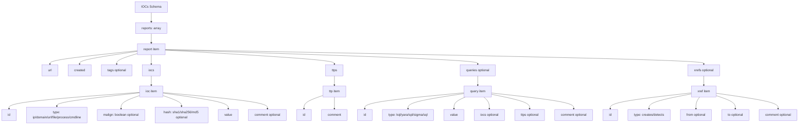

# IOCs Schema Documentation

This document describes the JSON schema defined in `cti_parser/schemes/iocs-schema.json`.

## Overview

The schema defines parsed CTI reports with:

- report metadata (`url`, `created`, optional `tags`)
- indicators (`iocs`)
- techniques (`ttps`)
- detection logic (`queries`)
- graph-style relationships (`xrefs` with directional `from` and `to` edges)

Schema metadata:

- `$schema`: `https://json-schema.org/draft/2020-12/schema`
- `$id`: `iocs-schema.json`
- `description`: `Parsed CTI reports`

## Top-Level Structure

| Property | Type | Required | Description |
|---|---|---|---|
| `reports` | array | Yes | List of parsed CTI report objects. |

## `reports` Items

Required fields: `url`, `created`, `iocs`, `ttps`

| Field | Type | Required | Description |
|---|---|---|---|
| `url` | string | Yes | URL of source CTI report, web or local file path. |
| `created` | string | Yes | Date in `DD/MM/YYYY` format. |
| `tags` | string[] | No | Labels associated with the report. |
| `iocs` | array | Yes | IOC objects. |
| `ttps` | array | Yes | TTP objects. |
| `queries` | array | No | Query objects. |
| `xrefs` | array | No | Cross-reference objects. |

## `iocs` Items

Required fields: `id`, `type`, `value`

| Field | Type | Required | Constraints | Description |
|---|---|---|---|---|
| `id` | string | Yes | format: `^ioc-[0-9]+$` | IOC identifier. |
| `type` | string | Yes | enum: `ip`, `domain`, `url`, `file`, `process`, `cmdline` | IOC kind. |
| `malign` | boolean | No | none | `true` for malicious, `false` for benign/contextual. |
| `hash` | string | No | enum: `sha1`, `sha256`, `md5` | Hash type for `type = file`. |
| `value` | string | Yes | none | IOC value. |
| `comment` | string | No | none | Analyst context. |

Notes:

- For file indicators, use `type: file` and set `hash`.
- `malign` is optional in schema but recommended for all IOC entries.

## `ttps` Items

Required fields: `id`, `comment`

| Field | Type | Required | Constraints | Description |
|---|---|---|---|---|
| `id` | string | Yes | format: `^ttp-[0-9]+$` | MITRE technique identifier label used by the dataset. |
| `comment` | string | Yes | none | Context for the technique usage. |

## `queries` Items

Required fields: `id`, `type`, `value`

| Field | Type | Required | Constraints | Description |
|---|---|---|---|---|
| `id` | string | Yes | format: `^query-[0-9]+$` | Query identifier. |
| `type` | string | Yes | enum: `kql`, `yara`, `spl`, `sigma`, `sql` | Query language/type. |
| `value` | string | Yes | none | Query content. |
| `iocs` | string[] | No | none | Associated IOC IDs. |
| `ttps` | string[] | No | none | Associated TTP IDs. |
| `comment` | string | No | none | Analyst context. |

## `xrefs` Items

Required fields: `id`, `type`

| Field | Type | Required | Constraints | Description |
|---|---|---|---|---|
| `id` | string | Yes | format: `^xref-[0-9]+$` | Cross-reference identifier. |
| `type` | string | Yes | enum: `creates`, `detects` | Relationship type. |
| `from` | string[] | No | none | Source entities in the relationship. |
| `to` | string[] | No | none | Target entities in the relationship. |
| `comment` | string | No | none | Extra relationship context. |

Notes:

- Keep direct query-to-IOC coverage in `queries[].iocs`.
- Use `xrefs` for directional graph edges that need explicit relationship semantics.

## Mermaid Diagram



## Example Valid Document

```json
{
  "reports": [
    {
      "url": "https://example.org/reports/cti-001",
      "created": "27/03/2026",
      "tags": ["apt", "phishing"],
      "iocs": [
        {
          "id": "ioc-1",
          "type": "file",
          "malign": true,
          "hash": "sha256",
          "value": "e3b0c44298fc1c149afbf4c8996fb92427ae41e4649b934ca495991b7852b855",
          "comment": "Malware dropper"
        },
        {
          "id": "ioc-2",
          "type": "domain",
          "malign": true,
          "value": "malicious.example.com"
        }
      ],
      "ttps": [
        {
          "id": "ttp-1",
          "comment": "T1203 exploitation observed"
        }
      ],
      "queries": [
        {
          "id": "query-1",
          "type": "kql",
          "value": "DeviceFileEvents | where SHA256 == 'e3b0c44298fc1c149afbf4c8996fb92427ae41e4649b934ca495991b7852b855'",
          "iocs": ["ioc-1"],
          "ttps": ["T1203"],
          "comment": "Hunt for known sample"
        }
      ],
      "xrefs": [
        {
          "id": "xref-1",
          "type": "detects",
          "from": ["query-1"],
          "to": ["ioc-1"],
          "comment": "Query detects this IOC"
        }
      ]
    }
  ]
}
```

## Validation Notes

- `created` must strictly match `DD/MM/YYYY`.
- `iocs[].type` accepts only: `ip`, `domain`, `url`, `file`, `process`, `cmdline`.
- `iocs[].hash` accepts only: `sha1`, `sha256`, `md5`.
- `queries[].ttps` may list related TTP IDs such as `T1203` or `T1053.005`.
- `xrefs[].type` accepts only: `creates`, `detects`.
- `xrefs[].from` and `xrefs[].to` define directional edges between entities.
- `queries[].type` accepts only: `kql`, `yara`, `spl`, `sigma`, `sql`.
