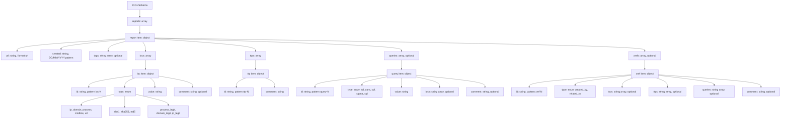

# IOCs Schema Documentation

This document describes the JSON schema defined in `cti_parser/schemes/iocs-schema.json`.

## Overview

The schema defines the structure for parsed CTI reports, including extracted indicators, threat techniques, detection queries, and cross-references.

Schema metadata:

- `$schema`: `https://json-schema.org/draft/2020-12/schema`
- `$id`: `iocs-schema.json`
- `description`: `Parsed CTI reports`

## Top-Level Structure

| Property | Type | Required | Description |
|---|---|---|---|
| `reports` | array | Yes | List of parsed CTI report objects. |

## `reports` Items

Each item in `reports` is an object with the following fields.

Required fields: `url`, `created`, `iocs`, `ttps`

| Field | Type | Required | Description |
|---|---|---|---|
| `url` | string | Yes | URL of source CTI report, web or local file path. |
| `created` | string | Yes | Date when the report was created, in format `DD/MM/YYYY`. |
| `tags` | string[] | No | List of tags associated with the report. |
| `iocs` | array | Yes | List of IOCs extracted from the report. |
| `ttps` | array | Yes | List of TTPs associated with the report. |
| `queries` | array | No | List of detection queries associated with the report. |
| `xrefs` | array | No | List of cross-references linking IOCs, TTPs, and queries. |

## `iocs` Items

Each item in `iocs` is an object with the following fields.

Required fields: `id`, `type`, `value`

| Field | Type | Required | Constraints | Description |
|---|---|---|---|---|
| `id` | string | Yes | pattern: `^ioc-[0-9]+$` | Unique identifier for the IOC. |
| `type` | string | Yes | enum (see below) | Type of IOC. |
| `value` | string | Yes | None | Value of the IOC. |
| `comment` | string | No | None | Additional comments or context about the IOC. |

**`iocs[].type` allowed values:**

| Value | Description |
|---|---|
| `ip` | IP address indicator |
| `domain` | Domain name indicator |
| `process` | Process name |
| `cmdline` | Command-line string |
| `url` | URL indicator |
| `sha1` | SHA-1 file hash |
| `sha256` | SHA-256 file hash |
| `md5` | MD5 file hash |
| `process_legit` | Legitimate process (context only, not malicious) |
| `domain_legit` | Legitimate domain (context only, not malicious) |
| `ip_legit` | Legitimate IP (context only, not malicious) |

## `ttps` Items

Each item in `ttps` is an object with the following fields.

Required fields: `id`, `comment`

| Field | Type | Required | Constraints | Description |
|---|---|---|---|---|
| `id` | string | Yes | pattern: `^ttp-[0-9]+$` | Unique MITRE identifier for the TTP. |
| `comment` | string | Yes | None | Additional comments or context about the TTP. |

## `queries` Items

Each item in `queries` is an object with the following fields.

Required fields: `id`, `type`, `value`

| Field | Type | Required | Constraints | Description |
|---|---|---|---|---|
| `id` | string | Yes | pattern: `^query-[0-9]+$` | Unique identifier for the query. |
| `type` | string | Yes | enum: `kql`, `yara`, `spl`, `sigma`, `sql` | Type of detection query. |
| `value` | string | Yes | None | The query string used to search for IOCs in security tools. |
| `iocs` | string[] | No | ref: ioc IDs | List of IOC IDs this query is associated with. |
| `comment` | string | No | None | Additional comments or context about the query. |

## `xrefs` Items

Cross-references link IOCs, TTPs, and queries together, expressing relationships such as authorship or relatedness.

Required fields: `id`, `type`

| Field | Type | Required | Constraints | Description |
|---|---|---|---|---|
| `id` | string | Yes | pattern: `^xref-[0-9]+$` | Unique identifier for the cross-reference. |
| `type` | string | Yes | enum: `created_by`, `related_to` | Type of this cross-reference. |
| `iocs` | string[] | No | ref: ioc IDs | List of IOC IDs associated with this cross-reference. |
| `ttps` | string[] | No | ref: ttp IDs | List of TTP IDs associated with this cross-reference. |
| `queries` | string[] | No | ref: query IDs | List of query IDs associated with this cross-reference. |
| `comment` | string | No | None | Additional comments or context about this cross-reference. |

## Mermaid Diagram



## Example Valid Document

```json
{
  "reports": [
    {
      "url": "https://example.org/reports/cti-001.pdf",
      "created": "27/03/2026",
      "tags": ["ransomware", "apt"],
      "iocs": [
        {
          "id": "ioc-1",
          "type": "sha256",
          "value": "e3b0c44298fc1c149afbf4c8996fb92427ae41e4649b934ca495991b7852b855",
          "comment": "Malware dropper"
        },
        {
          "id": "ioc-2",
          "type": "domain",
          "value": "malicious.example.com"
        }
      ],
      "ttps": [
        {
          "id": "ttp-1",
          "comment": "T1059.001 - PowerShell execution observed in dropper"
        }
      ],
      "queries": [
        {
          "id": "query-1",
          "type": "kql",
          "value": "DeviceFileEvents | where SHA256 == 'e3b0c44298fc1c149afbf4c8996fb92427ae41e4649b934ca495991b7852b855'",
          "iocs": ["ioc-1"],
          "comment": "Defender for Endpoint hunt"
        }
      ],
      "xrefs": [
        {
          "id": "xref-1",
          "type": "related_to",
          "iocs": ["ioc-1", "ioc-2"],
          "ttps": ["ttp-1"],
          "queries": ["query-1"],
          "comment": "All artefacts from the same campaign"
        }
      ]
    }
  ]
}
```

## Validation Notes

- `created` must strictly match `DD/MM/YYYY`.
- `iocs[].id` must match pattern `^ioc-[0-9]+$`.
- `ttps[].id` must match pattern `^ttp-[0-9]+$`.
- `queries[].id` must match pattern `^query-[0-9]+$`.
- `xrefs[].id` must match pattern `^xref-[0-9]+$`.
- `iocs`, `ttps`, and `queries` arrays in `xrefs` items hold **ID strings**, not nested objects — they reference items defined in the parent report.
- `queries[].type` accepts: `kql`, `yara`, `spl`, `sigma`, `sql`.
