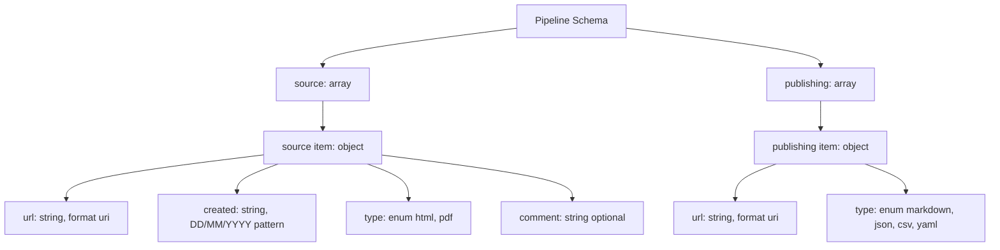

# Pipeline Schema Documentation

This document describes the JSON schema defined in `cti_parser/schemes/pipeline-schema.json`.

## Overview

The schema defines pipeline input and output configuration for CTI processing:

- `source`: input CTI reports to parse.
- `publishing`: output destinations and formats for extracted intelligence.

Schema metadata:

- `$schema`: `https://json-schema.org/draft/2020-12/schema`
- `$id`: `pipeline-schema.json`
- `description`: `CTI reports for parsing (inputs) and publishing formats (outputs)`

## Top-Level Structure

| Property | Type | Required | Description |
|---|---|---|---|
| `source` | array | Yes | List of CTI reports (inputs). |
| `publishing` | array | Yes | List of output targets/formats for published intelligence. |

## `source` Items

Each item in `source` is an object with the following fields.

Required fields: `url`, `created`, `type`

| Field | Type | Required | Constraints | Description |
|---|---|---|---|---|
| `url` | string | Yes | `format: uri` | URL of the CTI report, web or local file path. |
| `created` | string | Yes | `pattern: ^(0[1-9]|[12][0-9]|3[01])/(0[1-9]|1[0-2])/([0-9]{4})$` | Date when the report was created, in format `DD/MM/YYYY`. |
| `type` | string | Yes | enum: `html`, `pdf` | Type of report file. |
| `comment` | string | No | None | Additional comments about the report. |

## `publishing` Items

Each item in `publishing` is an object with the following fields.

Required fields: `url`, `type`

| Field | Type | Required | Constraints | Description |
|---|---|---|---|---|
| `url` | string | Yes | `format: uri` | URL network or local path of the published intelligence. |
| `type` | string | Yes | enum: `markdown`, `json`, `csv`, `yaml` | Output format for published intelligence. |

## Mermaid Diagram



## Example Valid Document

```json
{
  "source": [
    {
      "url": "https://example.org/reports/cti-001.pdf",
      "created": "26/03/2026",
      "type": "pdf",
      "comment": "Initial campaign report"
    },
    {
      "url": "file:///C:/cti/local-report.html",
      "created": "27/03/2026",
      "type": "html"
    }
  ],
  "publishing": [
    {
      "url": "file:///C:/cti/outputs/report.json",
      "type": "json"
    },
    {
      "url": "file:///C:/cti/outputs/report.csv",
      "type": "csv"
    }
  ]
}
```

## Validation Notes

- `created` must strictly match `DD/MM/YYYY`.
- `source[].type` only accepts `html` or `pdf`.
- `publishing[].type` only accepts `markdown`, `json`, `csv`, or `yaml`.
- URI validation follows JSON Schema `format: uri` behavior used by your validator.

